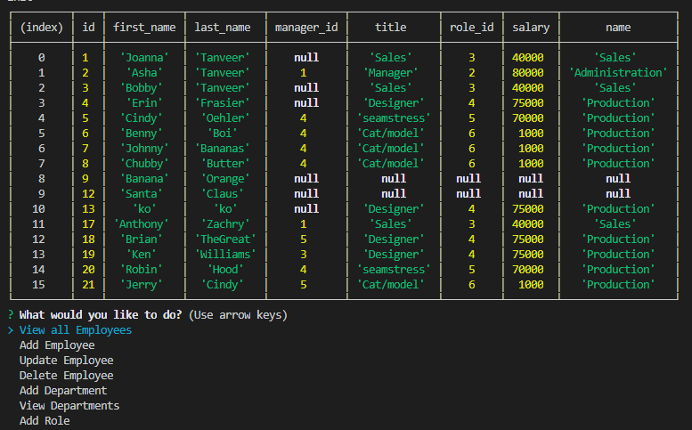

# Employee Manager

 

As a manager you are able to see and update all of your employee's pertinent information. You can add, update and delete employees. Create departments and roles, as well as see all employees by their manager.
working directory of employees and departments.
       
## Table of Contents
        
- [Technologies](#technologies)
- [Installation](#installation)
- [Usage](#usage)
- [Credits](#credits)
- [License](#license)
- [Questions](#questions)

### Technologies
    
The technologies utilized in this application are as follows: MySQL database, Inquirer, and . 
- MySQL database was used because This database works as persistent storage of your employees.
- Inquirer was used because Works as a user interface to collect data.. 
-  was used because . 
    
### Installation
    
To run this application successfully follow these steps:
1. Install [Employee_Manger](https://github.com/JoannaTanveer/Employee_Manager) to your local drive vis terminal/GitBash. This will install the package.json file which contains a list of all the dependencies for this application. 

2. Verify that node is installed in your computer by typing 'node' in the terminal/GitBash. If it returns
    >Welcome to Node.js v12.14.1. (or higher)
    >
    >Type ".help" for more information.
    
 Node.js is installed in your computer. If nothing happens or there is an error, visit [Node.js](https://nodejs.org/) and install the LTS version.
3. Type 'npm install' while in the terminal to install the dependencies. 

### Usage
    
The purpose of this program is to solve working directory of employees and departments., as mentioned above. Let's look a little further at how that can be accomplished.
- console.table is a visual graphic of your data
- Database acts as persistent storage
    
### Credits
    
The Dev community prides itself in the open source culture that it celebrates and maintains. This application couldn't have been made possible without the help of
- Anthony Zachry for his help understanding a full stack CLI application. [Anthony Zachry](https://www.linkedin.com/in/anthony-zachry-3464b551/)
- Chris Zarlengo for his help understanding routes. [Chris Zarlengo](https://www.linkedin.com/in/zarlengo/)
- console.table for it's visualization of data. [console.table](n/a)
    
#### Thank You!
    
    
### License
Licensed under the MIT license. 

### Questions
All questions and comments are welcome! Please contact me at joanna.tanveer@gmail.com	 or visit my [Github Profile](https://github.com/JoannaTanveer).
